Table of Contents
=================

   * [Operation](#operation)
      * [1.1 Mac安装使用Mysql教程(从零开始)](#11-mac安装使用mysql教程从零开始)
         * [1.1.1 安装MySQL](#111-安装MySQL)  
         * [1.1.2 安装数据库管理软件DBeaver](#112-安装数据库管理软件DBeaver)  
         * [1.1.3 DBeaver创建MySQL数据库](#113-DBeaver创建MySQL数据库)
         * [1.1.4 MySQL基本操作总结](#114-MySQL基本操作总结)  
            * [检索数据排序](#检索数据排序) 
         * [1.1.5 参考](#115-参考)
      * [1.2 Mac安装并使用R](#12-mac安装并使用r)
         * [1.2.1 前言](#121-前言)
         * [1.2.2 安装](#122-安装)
         * [1.2.3 使用](#123-使用)
            * [直方图](#直方图)  
            * [线图](#线图)  
            * [整理数据](#整理数据)
            * [导入数据](#导入数据)  
            * [导出文件](#导出文件) 
         * [1.2.4 参考](#124-参考)

# <center>Operation</center>
学习数据分析当中一些操作的总结分析
## <div id="11-mac安装使用mysql教程从零开始">1.1 Mac安装使用Mysql教程(从零开始)</div>
  
### <div id="111-安装MySQL">1.1.1 安装Mysql</div>
&nbsp;&nbsp;&nbsp;&nbsp;&nbsp;&nbsp;&nbsp;Mysql已经在博客[《Concept_Database》](/Users/ruogulu/Desktop/Study/DataAnalysis/Concept.md)中进行过讲解，这里不做赘述，直接安装。
	1. 访问 [MySQL官网下载页](https://dev.mysql.com/downloads/mysql/) 并下载MySQL，详情见下图：  
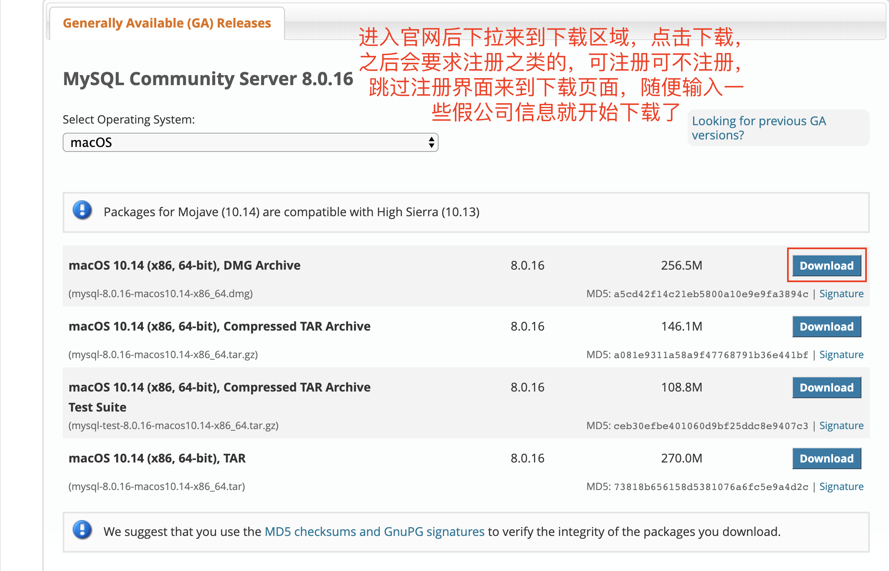
<center>图1-1.进入官网</center>	  
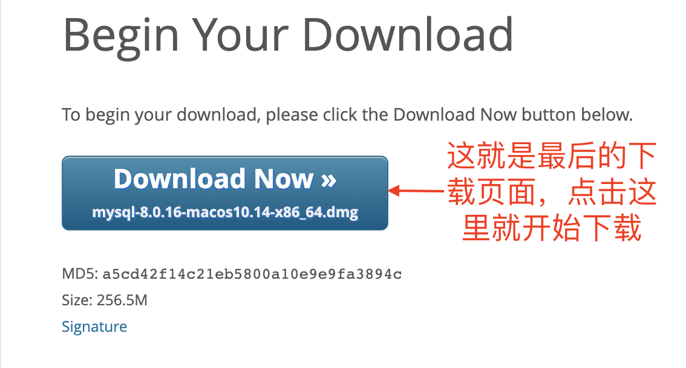  
<center>图1-2.下载</center> 
	2. 双击安装包`mysql-8.0.16-macos10.14-x86_64.dmg` ，之后开始安装过程，一直点击`继续`就好，详情见下图：  
		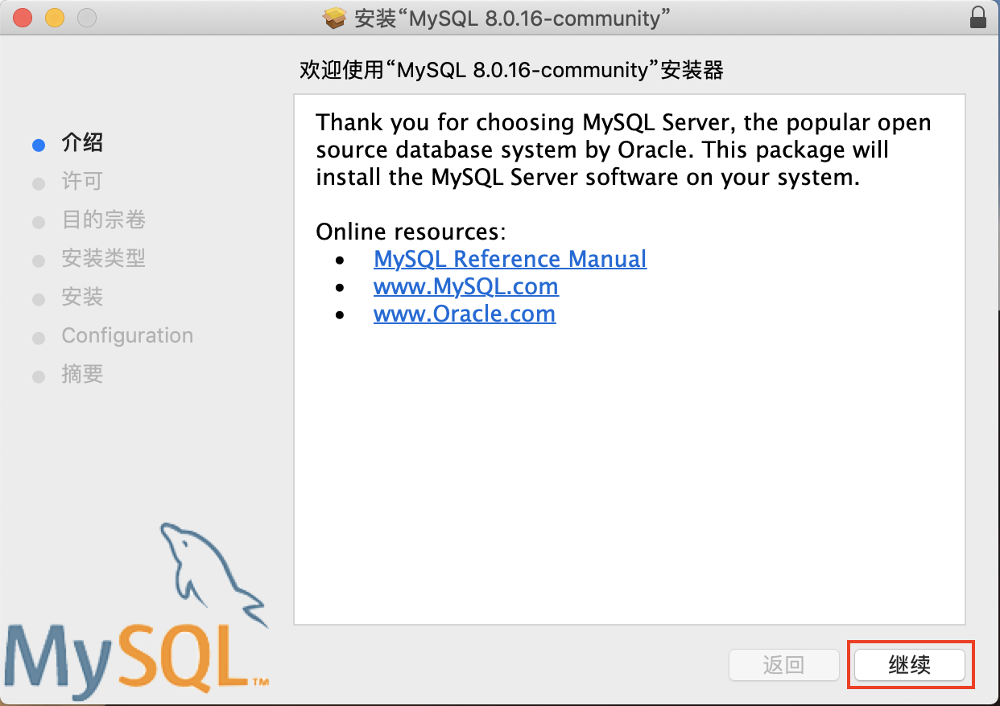  
		<center>图1-3.继续</center> 
		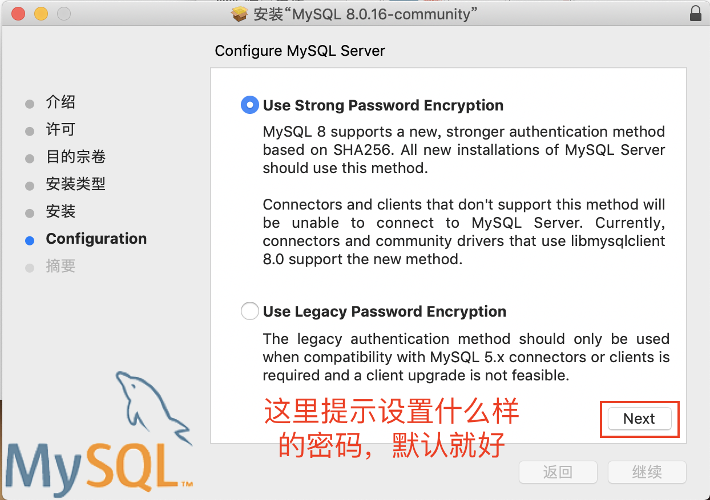
		<center>图1-4.加密方式</center> 
		  
		<center>图1-5.设置密码</center>
		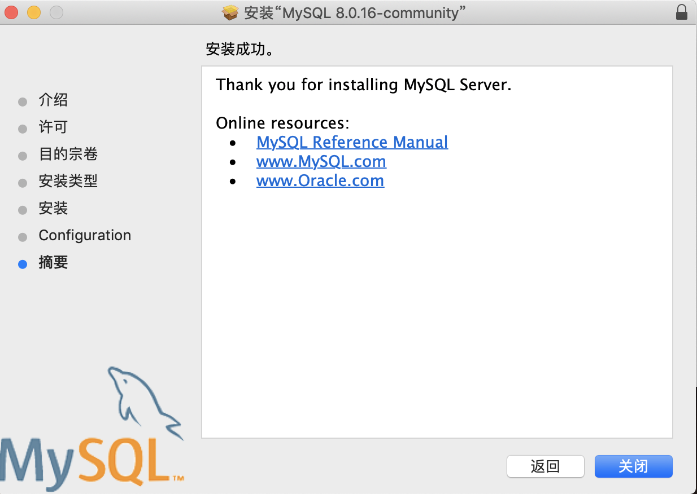  
		<center>图1-6.完成</center>
	3. 检验安装，打开系统偏好设置，可以看到MySQL安装成功，详情见下图：
	  
	<center>图1-7.系统偏好设置</center>  
	  
	<center>图1-8.启动MySQL</center>  
	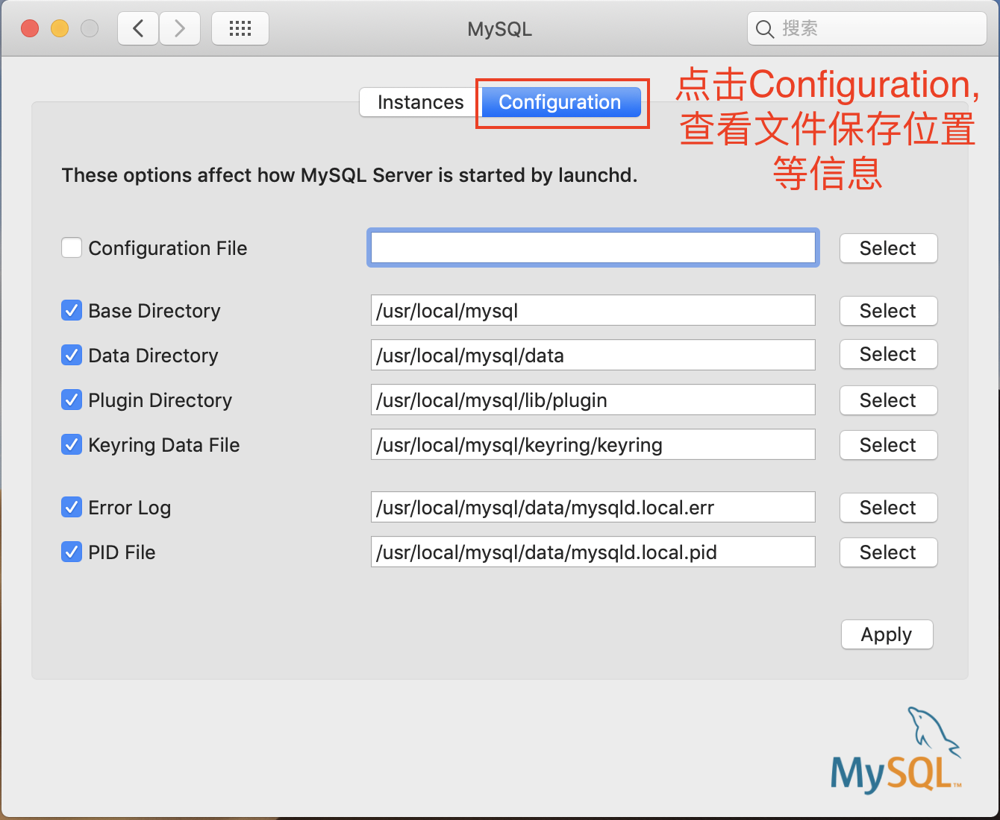  
	<center>图1-9.查看MySQL路径设置</center>
	4. MySQL已经安装完毕，接下来要将它与终端连接，详情见下图：  
	添加MySQL运行路径：
	`$ PATH="$PATH":/usr/local/mysql/bin`  
	查看是否添加成功：  
	`$ which mysql`  
	成功则显示：  
	`/usr/local/mysql/bin/mysql`  
	登录MySQL：  
	`$ mysql -u root -p`  
	回车后要求输入密码，我正确输入密码后出现报错：  
	`ERROR 2002 (HY000): Can't connect to local MySQL server through socket '/tmp/mysql.sock' (2)`  
	这是由于我没有第3步将MySQL打开，打开MySQL，重新输入并回车，顺利登录MySQL：  
	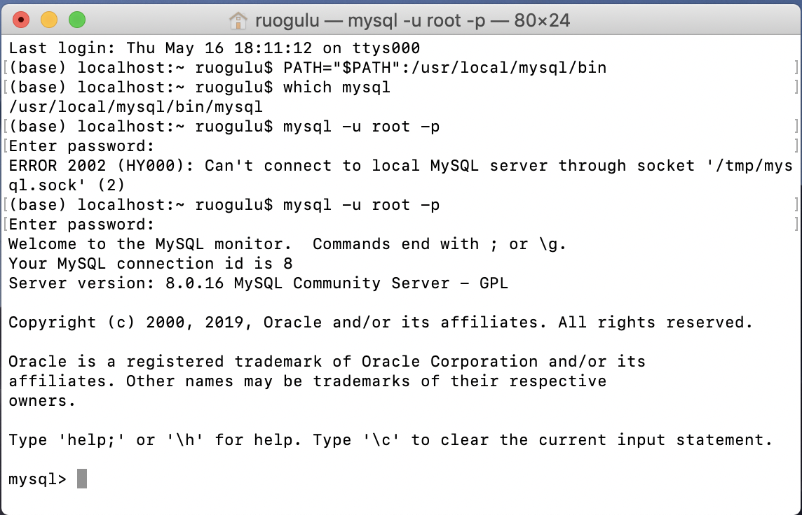  
	<center>图1-10.MySQL连接终端</center>
  
### <div id="112-安装数据库管理软件DBeaver">1.1.2 安装数据库管理软件DBeaver</div>
 
1. 访问 [DBeaver官网下载页](https://dev.mysql.com/downloads/mysql/) 并下载DBeaver，详情见下图：  
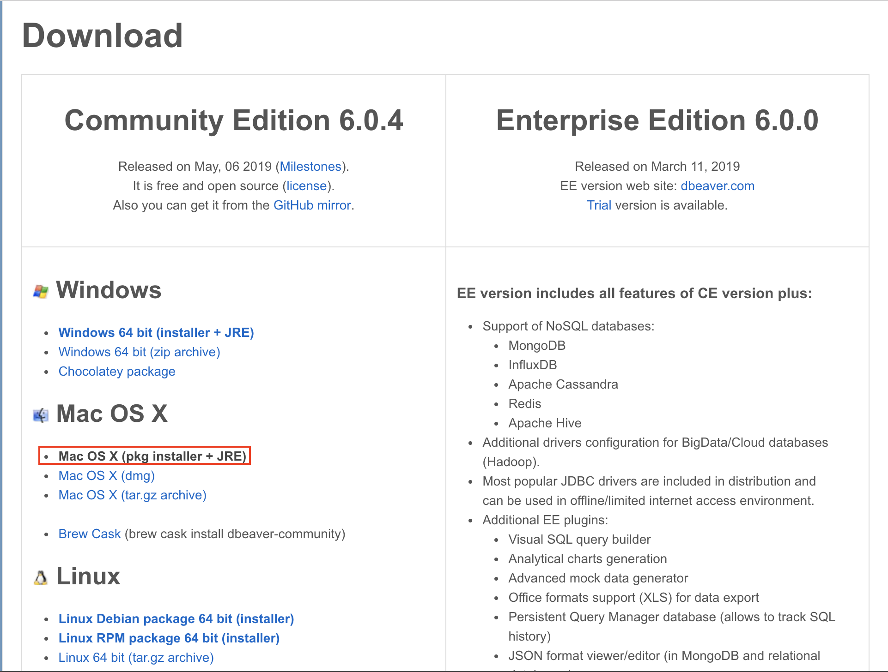  
	<center>图2-1.下载</center>  
 
2. 下载完成后直接双击安装包进行安装，一直点继续就好；  
3. 安装完毕后在启动台找到DBeaver并打开，将其连接数据库（打开后会自动提示连接数据库），详情见下图：  
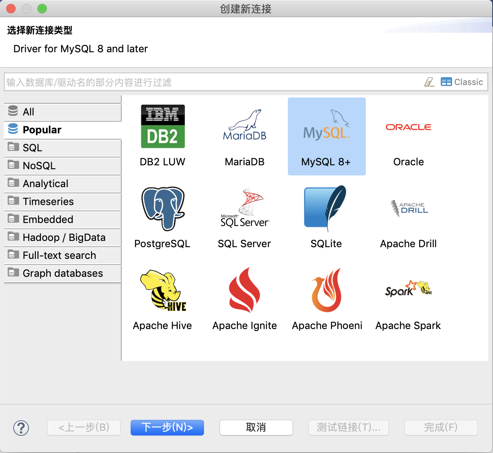   
	<center>图2-2.连接数据库</center>  
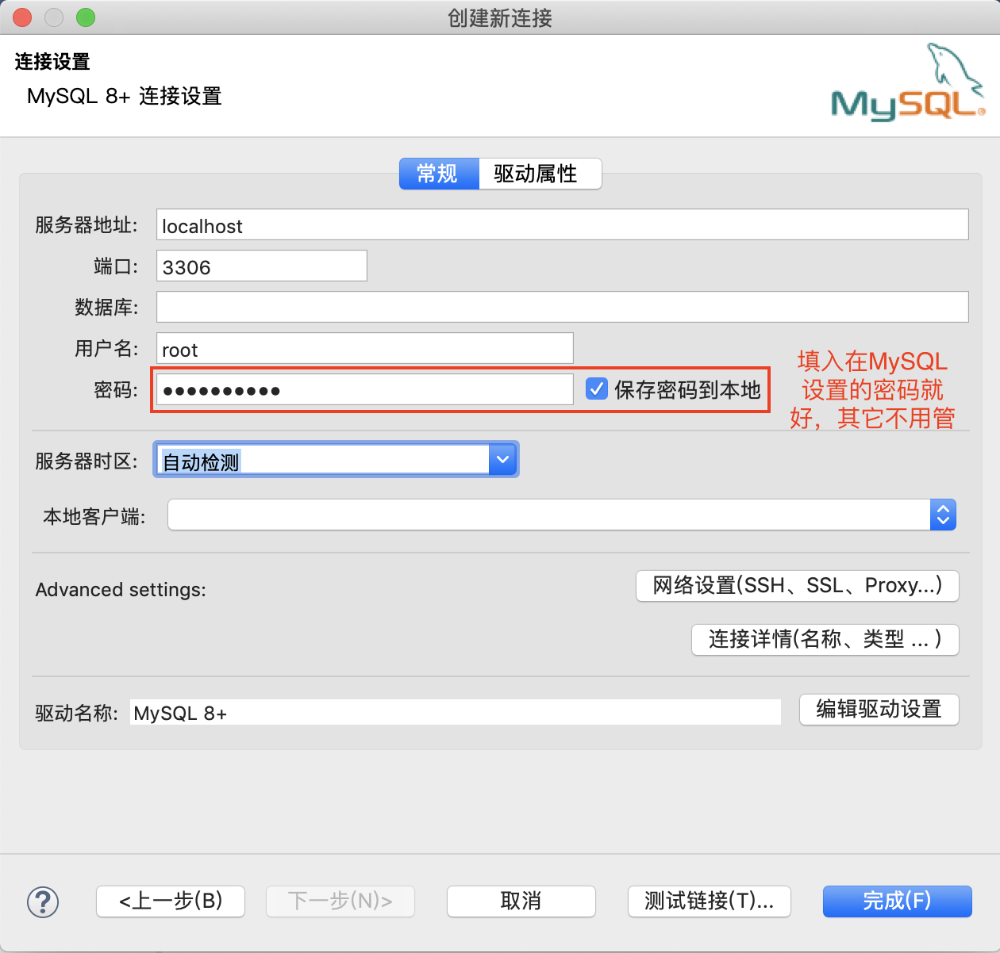  
	<center>图2-3.连接设置</center>  
	 
4. 连接MySQL数据库完毕后，会提示是否建立一个数据库，我嫌自己建数据库麻烦，所以就同意建立了一个数据库，方便自己尽快尝试SQL操作，上述操作完毕后的DBeaver如下：  
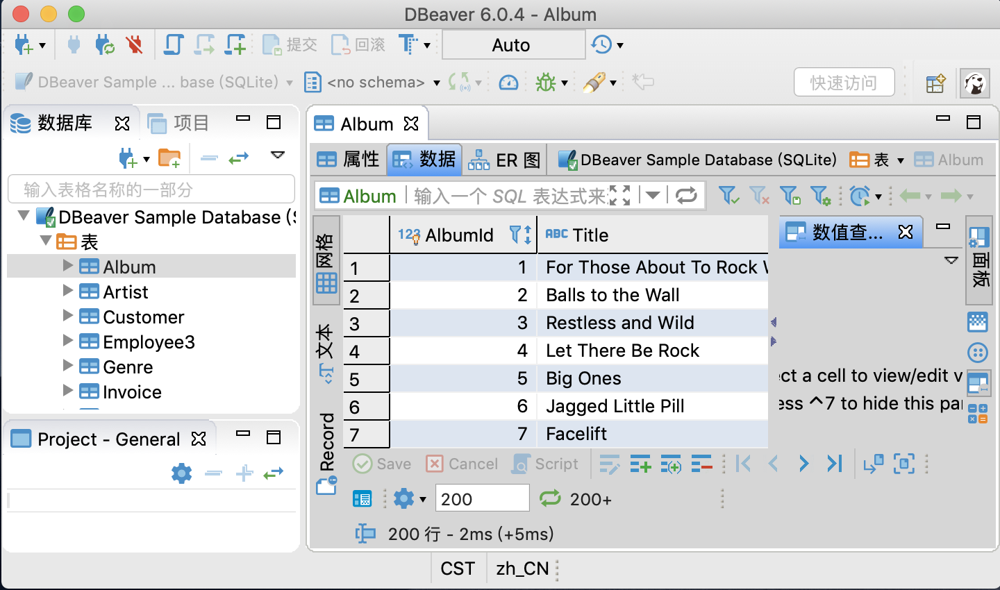  
	 <center>图2-4.DBeaver</center>  
	 
&nbsp;&nbsp;&nbsp;&nbsp;&nbsp;&nbsp;&nbsp;初步安装使用MySQL顺利完成，接下来可以愉快地学习SQL了。我会在以后博客中持续记录自己学习SQL的心得。
  
### <div id="113-DBeaver创建MySQL数据库">1.1.3 DBeaver创建MySQL数据库</div>
1. 启动MySQL数据库，具体见[]()图1-8；  
2. 打开DBeaver,在窗口左侧查看已连接数据库列表，查看是否有带有"localhost"的选项（图1-1），如果有则跳到第4步；  
  
	<center>图3-1.本地服务器</center>
	
3. 创建localhost：在以连接数据列表中右键选择“creat连接”（图1-6），之后步骤和[安装数据库管理软件DBeaver]()中第3步之后一样；
	> loclahost指本地数据库服务器，它不会解析成ip，也不会占用网卡、网络资源，不受网络防火墙和网卡相关的的限制。  
4. 双击有"localhost"的选项（此时可能会出现报错，见下文[出现问题及解决](#出现问题及解决)），展开之后右键"数据库"，选择新建数据库（图1-2）；  
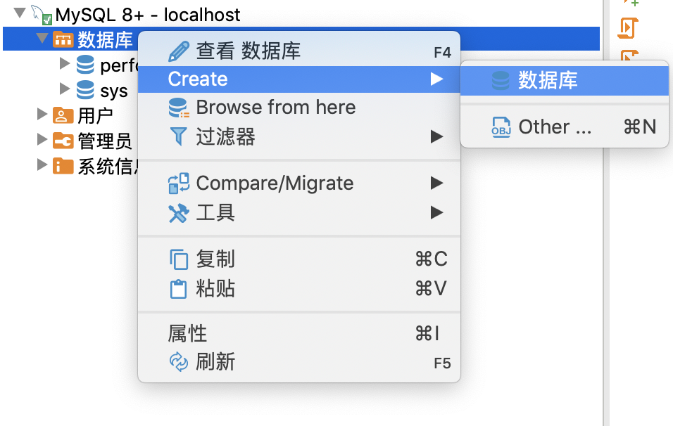  
	<center>图3-2.创建数据库</center>
	  
5. 将数据库命名为自己想要的名字；
6. 若数据库有中文，Charset最好选为gbk，若无则保持默认；
7. 点击“确定”，MySQL数据库创建完毕。  
<div id="出现问题及解决">**出现问题及解决：**

`Public Key Retrieval is not allowed`
	  
&nbsp;&nbsp;&nbsp;&nbsp;&nbsp;&nbsp;&nbsp;该报错表示不允许客户端从服务器获取公钥。可以通过修改驱动属性`allowPublicKeyRetrieval=true`来解决该问题，详情见下图：
	  
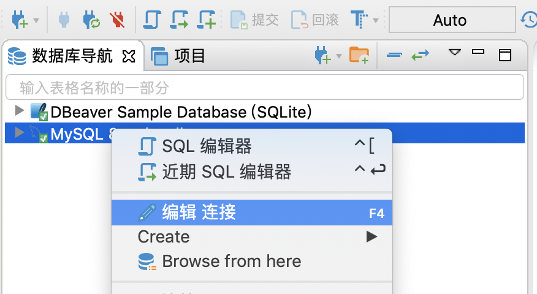  
	<center>图3-3.编辑连接</center> 
	 
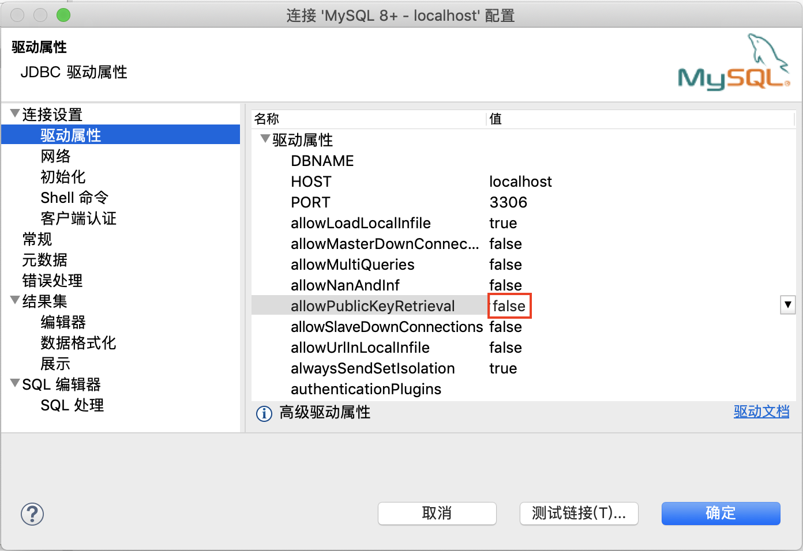  
	<center>图3-4.PublicKeyRetrieval属性</center>   
	  
`No timezone mapping entry for '自动检测'`
	  
&nbsp;&nbsp;&nbsp;&nbsp;&nbsp;&nbsp;&nbsp;该报错表示服务器时区有问题。一样通过修改驱动属性来解决该问题，详情见下图：
	  
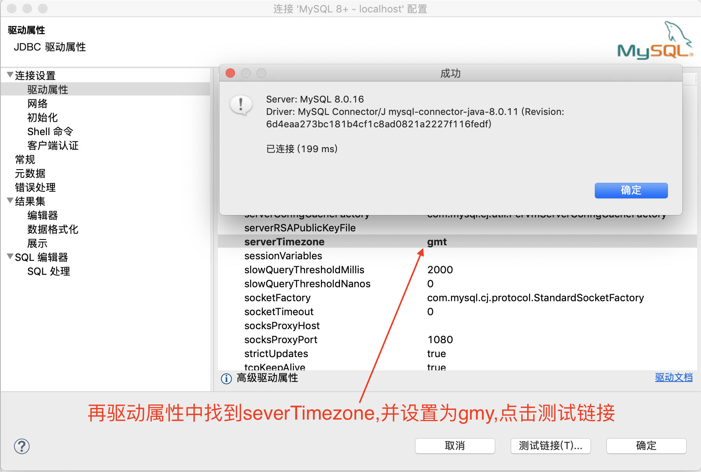 
    <center>图3-5.timezone属性</center>
    
### <div id="114-MySQL基本操作总结">1.1.4 MySQL基本操作总结</div>
&nbsp;&nbsp;&nbsp;&nbsp;&nbsp;&nbsp;&nbsp;本文是关于MySQL基本操作的总结，也是《SQL必知必会》这本书的读书笔记，将自认为的其中重要知识点摘抄总结出来。以下图所示五个表格为例进行展示与介绍。

<div align="center">
<figure class="half">
    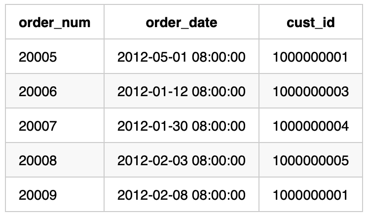
    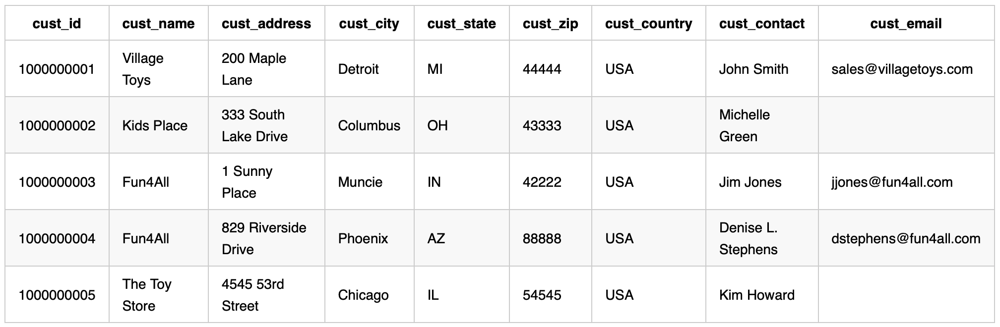
    <center>图4-1.表格Orders和Customers</center>
</figurer>
</div>

<div align="center">
<figure class="half">
    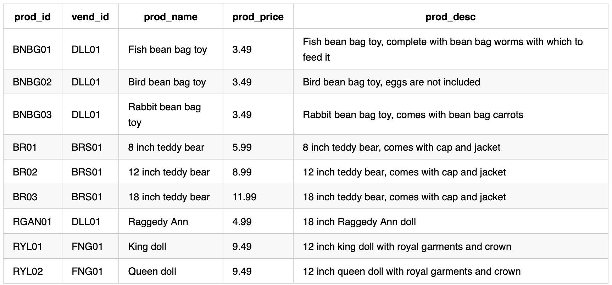
    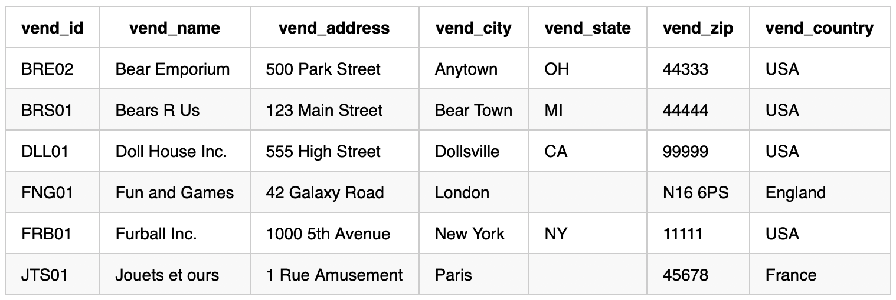
    <center>图4-2.表格Products和Vendors</center>
</figurer>
</div>
 
<center>
    
</center>  
<center>图4-3.表格OrderItems</center>

+ **<div id="检索数据排序">检索数据排序</div>**  
  
1. 单列排序
 
 ```
 SELECT prod_name
 FROM Products
 ORDER BY prod_name;
 ```  
 &nbsp;&nbsp;&nbsp;&nbsp;&nbsp;&nbsp;&nbsp;将检索出的 prod\_name 数据根据 prod\_name进行排序。  

2. 多列排序
 
 ```SQL
 SELECT prod_id, prod_price, prod_name
 FROM Products
 ORDER BY prod_price, prod_name
 ```  
 &nbsp;&nbsp;&nbsp;&nbsp;&nbsp;&nbsp;&nbsp;将检索出的数据 prod\_id，prod\_price，prod\_name先根据 prod_price 排序，如果有产品的价格相同则再根据 prod_name 进行排序。
 
3. 按列相对位置排序  
 
 ```SQL
 SELECT prod_id, prod_price, prod_name
 FROM Products
 ORDER BY 2, 3;
 ```
 &nbsp;&nbsp;&nbsp;&nbsp;&nbsp;&nbsp;&nbsp;用 SELECT 中列名的相对位置代替多列排序中 ORDER BY 后面的列名，依然遵循多列排序的规则。  
 
4. 降序排列  

 ```SQL
 SELECT prod_id, prod_price, prod_name
 FROM Products
 ORDER BY prod_price DESC, prod_name;
 ```  
 &nbsp;&nbsp;&nbsp;&nbsp;&nbsp;&nbsp;&nbsp;一般默认进行升序排列，要降序排列时，只需在进行排序的列名后添加语句`DESC`，多列降序排列时则在每一列后面都添加语句`DESC`。  
 
+ **数据过滤**  

### <div id="115-参考">1.1.5 参考</div>  
1. [mac 安装mysql详细教程](https://www.jianshu.com/p/07a9826898c0) 
2. [第 28 天：安裝/使用 DBeaver 管理資料庫](https://ithelp.ithome.com.tw/articles/10196383)
**DBeaver创建MySQL数据库**
[1] Ben Forta.[SQL必知必会-中文-第4版](https://github.com/Roggu123/DataAnalysis/blob/master/References/SQL必知必会-中文-第4版..pdf)  
[2] Jiezi.[连接 MYSQL 8.X 版本报错解决](https://lequ7.com/2019/04/08/richang/lian-jie-MySQL-8x-ban-ben-bao-cuo-jie-jue/)  
[3] serge-rider.[Timezone and MySQL Connector](https://github.com/dbeaver/dbeaver/issues/3599)  
[4] zyz511919766.[MySQL 中 localhost 与 127.0.0.1 的区别](https://blog.csdn.net/zyz511919766/article/details/21384791) 
  
  
## <div id="12-Mac安装并使用R">1.2 Mac安装并使用R</div>
### <div id="121-前言">1.2.1 前言</div>
由于今后工作可能从事数据分析，所以最近在通过《深入浅出数据分析》这本书进行数据分析的入门学习，书中有一部分内容是用R来进行分析学习，所以我尝试学习了一下R的安装使用，在此记录下来。
### <div id="112-安装">1.2.2 安装</div>  
1. 访问[官网](https://cran.r-project.org/mirrors.html) 并下载R，详情见下图：  
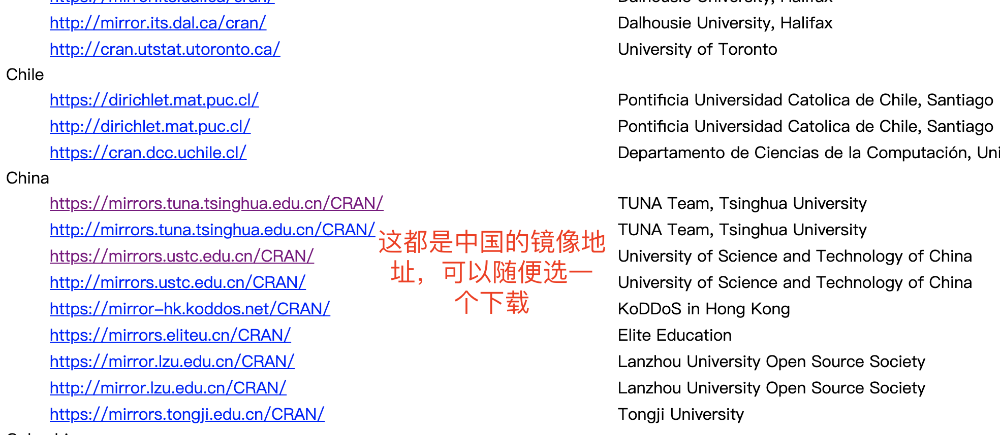  
<center>图2-1.选择镜像
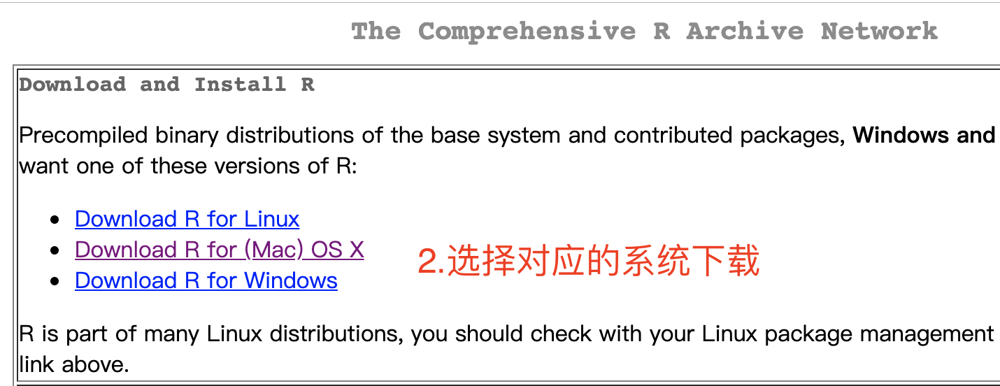  
<center>图2-2.选择系统  
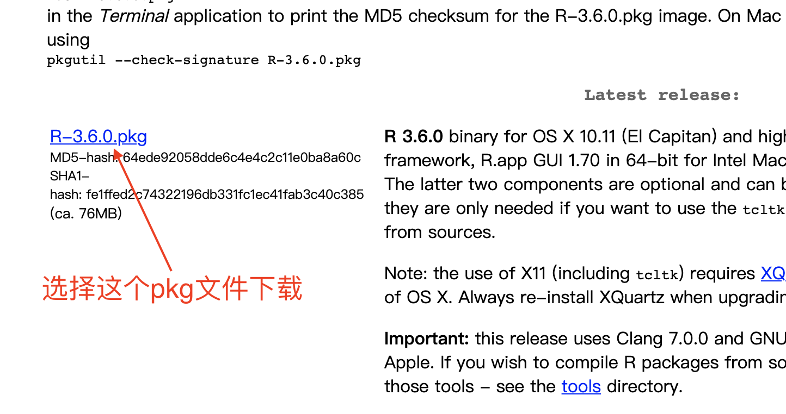
<center>图2-3.下载R  

2. 尝试运行一个R脚本，我使用了《深入浅出数据分析》中的R脚本，过程如下：
 + 输入命令  
 `source("http://www.headfirstlabs.com/books/hfda/hfda.R")`  
 + 出现报错  
 `Error in file(filename, "r", encoding = encoding) : 
  cannot open the connection to 'http://www.headfirstlabs.com/books/hfda/hfda.R'
In addition: Warning message:
In file(filename, "r", encoding = encoding) :
  URL 'https://www.oreilly.com/library/view/head-first-data/9780596806224/': status was 'Couldn't connect to server'`  
 或  
 `Error in source("http://www.headfirstlabs.com/books/hfda/hfda.R") : 
  http://www.headfirstlabs.com/books/hfda/hfda.R:1:1: unexpected '<'
1: <
    ^`  
 + 上面的报错指无法连接至脚本所在的服务器和脚本有问题，下载该脚本至本地并打开，脚本内容如下  
 `employees <- read.csv("http://www.headfirstlabs.com/books/hfda/hfda_ch09_employees.csv",header=TRUE)`  
 + 既然脚本无法通过网络连接打开，那么脚本中的网址也应该打不开，下载[csv文件](https://github.com/Roggu123/DataAnalysis/blob/master/hfda_data/hfda.R)并更改脚本  
 `employees <- read.csv("~/Desktop/Study/DataAnalysis/hfda_data/hfda_ch09_employees.csv",header=TRUE)`  
 + 输入`employees`，正确输出csv文件中内容  
 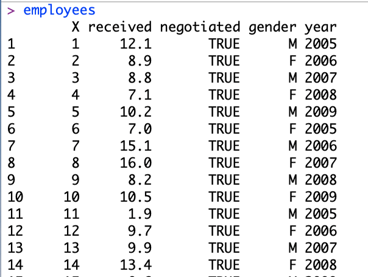  
 + 根据csv文件内容画出直方图`hist(employees$received, breaks=50)`  
 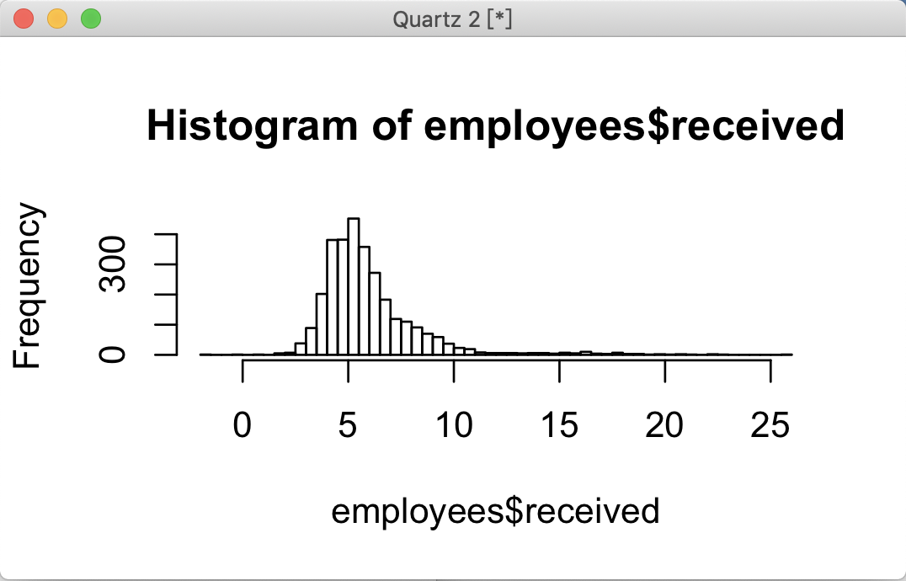  
3. 结果和书中展示的结果相同，R安装成功，初步体验了R的使用，和Matlab有点相似而且不收费，可以继续开心学习了。

### <div id="123-使用">1.2.3 使用</div>  
+ **<div id="直方图">直方图<div>**  
 1. 绘制直方图 `hist(data, breaks)`  
 **data：**表示要绘制的数据；  
 **breaks：**告诉R如何分组，指定格式有多种；
   
		>第一种，给定一个向量，指出不同的断点，如`hist(data,breaks=c(0.5, 1.5, 2.5, 3.5))`；  
第二种，指定分隔好的区间的个数，会根据区间个数自动去计算区>间的大小，如上文所示。  

		**freq：**逻辑值，默认值为TRUE , y轴显示的是每个区间内的频数，FALSE, 代表显示的是频率（= 频数/ 总数），如`hist(data, breaks = 50, freq = F)`  
		**probability：** 逻辑值，和 freq 参数的作用正好相反，TRUE 代表频率， FALSE 代表频数  
		[更多详情](https://www.cnblogs.com/xudongliang/p/6913363.html)  
 2. 保存直方图  

 ```` r
 > png("路径名/图片名.png")
 > hist(data, breaks=50, ...)
 > dev.off()
 ````
 
 + **<div id="线图">线图</div>**
 1. 绘制线图
 `abline(a=NULL, b=NULL, h = NULL, v=NULL, reg=NULL, coef=NULL, untf=FALSE, ol="", ...)`  
**参数解释：**  
参数`a`表示绘制直线的截距；  
参数`b`表示绘制直线的斜率；  
参数`h`表示绘制水平线时的纵轴值；  
参数`v`表示绘制垂直线时的横轴值；  
参数`reg`表示一个回归对象名称，即回归直线的名称；  
参数`coef`是一个二维向量，给出了截距和斜率；
参数`untf`是一个逻辑值，表示是否对数变换，若为TRUE且坐标中至少一个进行了对数变换，则会画出未对数变换前的曲线。  
**示例；**  
在散点图中画出两条直线myLmSmall`y=0.8+0.9x`和myLmBig`y=7.8+0.3x`,输入如下代码：  

			> plot(employees$requested[employees$negotiated == TRUE],  
			employees$received[employees$negotiated==TRUE])  
			> abline(myLmSmall,col="blue")  
			> abline(myLmBig,col="red")  
 			
 	 <center></center>
 		<center>图3-1.线图</center> 			   
   
   2. 保存线图  
 
 		``` r
 		# 和直方图一样  
 		> png("~/Desktop/Study/DataAnalysis/hfda_data/ch11_predict.png")  
 		> plot(employees$requested[employees$negotiated == TRUE],  
 		employees$received[employees$negotiated==TRUE])  
 		> abline(myLmSmall,col="blue")
 		> abline(myLmBig,col="red")
 		> dev.off()
 		``` 

+ **<div id="整理数据">整理数据</div>**  
&nbsp;&nbsp;&nbsp;&nbsp;&nbsp;&nbsp;&nbsp;可以利用正则表达式在**R**中指定复杂的模式以便匹配和替换文本字符串，从而进行数据清理。常用正则表达式指令如下：
 1. 替换字符串
 `新列名 <- sub("被替换字符串(正则表达式模式)"，"替换字符串"，表名$列名)`
 2. 删除某些导致重复的列  
 `表名$列名 <- NULL`
 3. 删除重复名称  
 `列名 <- Unique(列名)`  
 一列当中有些名称发生重复，利用`Unique()`进行删除，重复名称所在的行也会被删除。   
 
 **注意**：  
 在删除重复数据时可以先通过主键对数据进行排序，进一步分析数据重复的原因，然后进行列删除及重复名称删除。
 		 
+ **<div id="导入数据">导入数据</div>**
 1. 导入csv `read.csv(file, header, sep = ",",quote="\"", dec=".",
fill,comment.char="")`  
**参数解释：**   
参数`flie`表示导入文件，为文件绝对或相对路径；  
参数`header`表示是否在文件第一行显示标题，默认为TRUE；  
参数`seq`指定分隔符，默认为空格；参数`quote`表示引号，默认为双引号；  
参数`dec`表示小数点，默认为`.`；  
参数`fill`表示是否填充，即遇到行不相等的情况，空白域自动添加既定值，默认填充；  
参数`comment.char`指定用于表示注释的引导符号。  
**上述参数除了`file`外，一般设定为默认就可以。**  
 2. 导入其它表格  
 `read.table(file, header = FALSE, sep ="", quote = "\"'",
dec = ".", skip = 0,
strip.white = FALSE, blank.lines.skip =TRUE,
comment.char = "#")`  
各参数含义和`read.csv()`差不多。  
+ **<div id="导出文件">导出文件</div>** 
 1. 保存为R文件  
 `save.image("路径名/文件名.RData")`  
 &nbsp;&nbsp;&nbsp;&nbsp;&nbsp;&nbsp;&nbsp;保存为R文件可以保存之前运行时产生的变量数据等，打开之后可以继续上次的运行结果进行操作。
 2. 保存为txt文件  
 &nbsp;&nbsp;&nbsp;&nbsp;&nbsp;&nbsp;&nbsp;直接在界面选择`file -> save as`就可以将代码保存为txt格式，方便详细查看代码，但不会保存之前产生的变量数据，也无法用R打开。
  
### <div id="124-参考">1.2.4 参考</div>  
1. [R（1）Mac OS 下安装R语言开发环境](https://blog.csdn.net/freewebsys/article/details/45825267)  
2. [R语言的各种报错及其解决方法](https://blog.csdn.net/Bone_ACE/article/details/47324233)  
3. [小白入门R语言时遇到的问题](https://zhuanlan.zhihu.com/p/26352990)  
4. [R语言hist绘图函数](https://www.cnblogs.com/xudongliang/p/6913363.html)   
**read.csv用法解析** 
5. [R语言——read.table;read.csv（读取外部数据）](https://blog.csdn.net/AnneQiQi/article/details/51085675)  
**线图**  
[6] 优雅的代码.[在回归方程中可以添加趋势线](http://www.sohu.com/a/252882522_100261403)  
**R的保存**  
[7] 孙洪双.[R学习笔记（一） 变量的保存与加载](https://zhuanlan.zhihu.com/p/29743511)

  
 